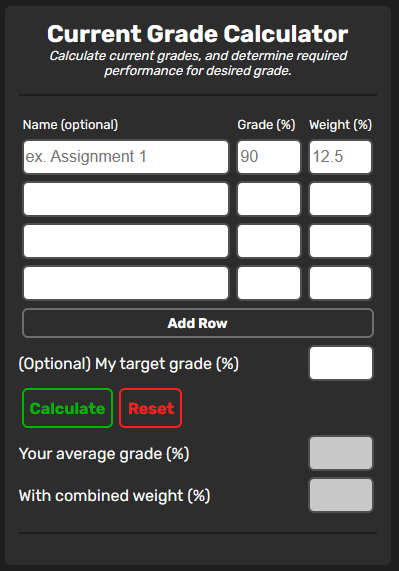
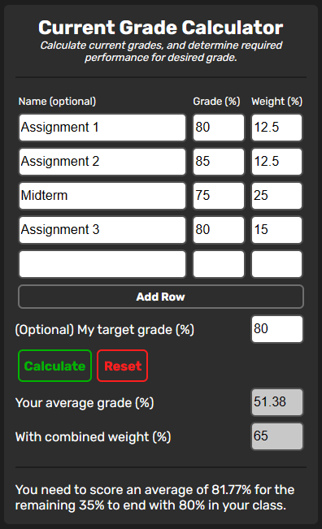
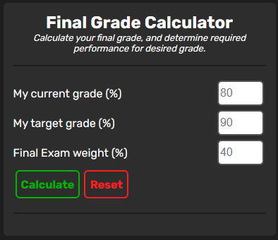
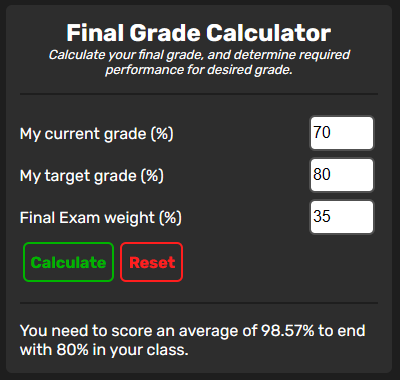

# Grade Calculator

Calculate your grades for your classes!

## :camera_flash: Features

#### Current Grade Calculator

- Intended to help students see what their current grades are by using a weight based grading system.
- Accessibility to as much space for inserting grades as necessary.
- Optionally, students can calculate what is needed to achieve their targeted grade by using the current grade that is calculated, along with the leftover weight.

  

    
  

  

    
  

#### Final Grade Calculator

- Intended to be used when all grades are distributed except for one final examination.
- Given a percentage of the students current grade, targeted grade, and the weight of the final assessment, can be used to determine what grade is required on the final assessment to achieve desired grade.

  

    
  

  

    
  

#### :moon: Dark / Light Theme

- Dark mode is the default theme to save your eyes, while light mode is also an option.
- You browser will remember which theme you used last.

## :pencil: TODO

- Mathematical explanations for each tool.
- Letter Grade/GPA calculator.

## :book: References

- This grade calculation tool is not my original idea, however during my academic career I have used tools from these people/sources which inspired me to create my own version!
- **Roger Chen**: https://rogerhub.com/final-grade-calculator/
- **RapidTables**: https://www.rapidtables.com/calc/grade/grade-calculator.html
